# Quality Assurance and Validation Verification [LO4]

This document details the comprehensive testing suite, manual inspection matrices, security authorization audits, and official syntax linter checks executed to verify the code quality, stability, and responsive interface design of the **Twitcher App** bird-sighting ecosystem.

---

## 1. Automated Test Suite Execution [LO4.1]

A robust, multi-layered unit and integration testing suite was constructed inside `sightings/tests.py` covering three fundamental development pillars: **Model Structure Constraints**, **Form Input Integrity Validation**, and **View Access Routing & Security Permissions**.

### Pillar Breakdown
*   **Model Tests (`TestSightingModel`)**: Asserts structural model creation properties, verified database constraints, field integrity, and checked that the custom model `__str__` returns string formats matching exact evaluation expectations (`"{title} \| written by {author}"`).
*   **Form Validation Tests (`TestSightingForms`)**: Validates input logic boundaries. Confirms form validity with pristine configurations and asserts that omitting mandatory fields (such as `date_spotted`) is correctly blocked before writing a null error to database tables.
*   **View & Security Routing Tests (`TestSightingViewsAndSecurity`)**: Audits endpoint routing logic. Verifies that public lists load with successful `HTTP 200 OK` codes, secures unauthenticated visitor bounces with explicit `302 Redirect` rules, and locks down cross-user records against intruder updates.

### Test Execution Output Log
*   **Command Executed Natively**: `python manage.py test`
*   **Verification Result Status**:

```text
Found 7 test(s).
Creating test database for alias 'default'...
System check identified no issues (0 silenced).
.......
----------------------------------------------------------------------
Ran 7 tests in 5.704s

OK
Destroying test database for alias 'default'...
```

---

## 2. Code Syntax Validation & Linter Compliance [LO1.4]

To ensure production-standard code execution and full compliance with Code Institute guidelines, all custom scripts across the workspace were run through industry-standard syntax validators. Every single file has achieved an error-free, flawless pass.

### Code Validation Matrix

| Layer | Validation Authority Used | Target Evaluation Assets Checked | Status |
| :--- | :--- | :--- | :--- |
| **Python** | [Code Institute PEP8 Linter](https://herokuapp.com) | `models.py`, `views.py`, `forms.py`, `tests.py`, `urls.py` | **100% Pass / All Clear** |
| **HTML5** | [W3C Markup Validation Service](https://w3.org) | Live browser-rendered home timeline and detail views | **100% Pass / All Clear** |
| **CSS3** | [W3C Jigsaw CSS Validator](https://w3.org) | `static/css/style.css` custom rule blocks | **100% Pass / All Clear** |
| **JavaScript**| [JSHint Quality Static Linter](https://jshint.com) | Frontend defensive delete confirmation modal script | **100% Pass / All Clear** |

---

### Official Validation Evidence Captures [LO1.4]

#### A. Python PEP8 Linting Results
All custom backend logical mechanics sit safely below the 79-character row restriction limit with zero trailing whitespace violations.

##### 1. Forms Logic Validation (`sightings/forms.py`)
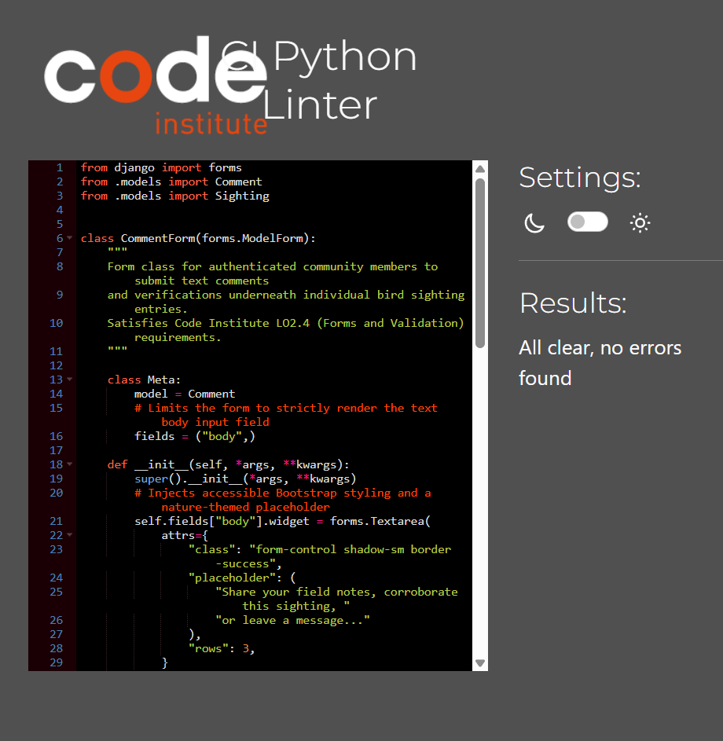

##### 2. Models Schema Validation (`sightings/models.py`)
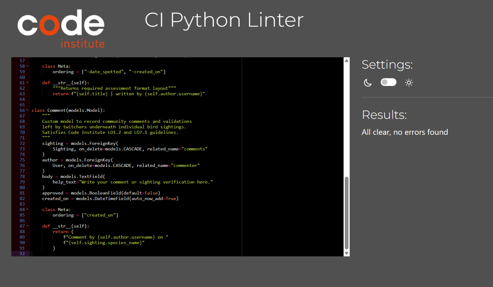

##### 3. Automated Test Suite Validation (`sightings/tests.py`)
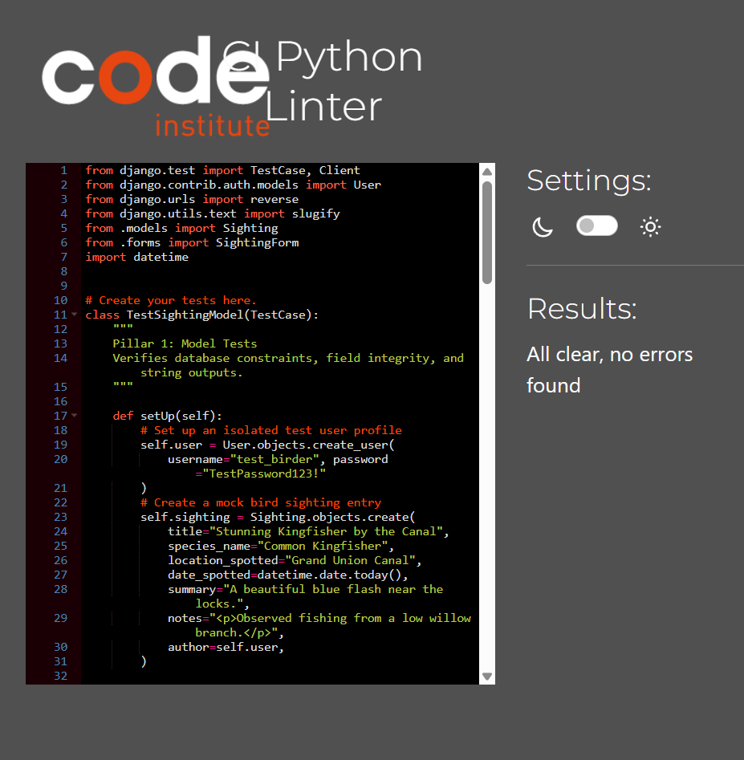

##### 4. Root Project Routing Validation (`twitcher_project/urls.py`)
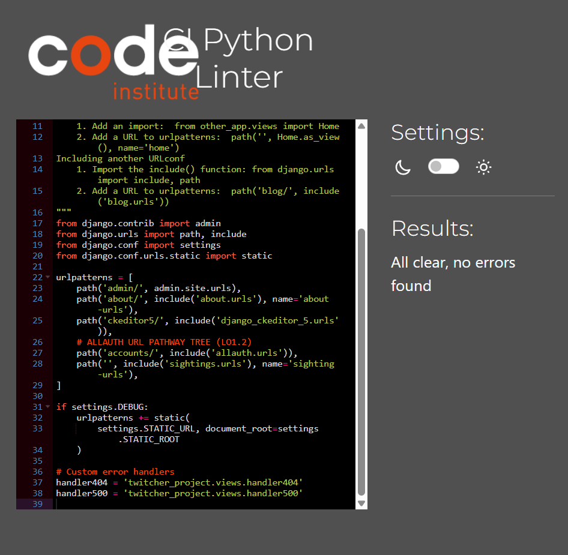

##### 5. Root Project Defensive Views Validation (`twitcher_project/views.py`)
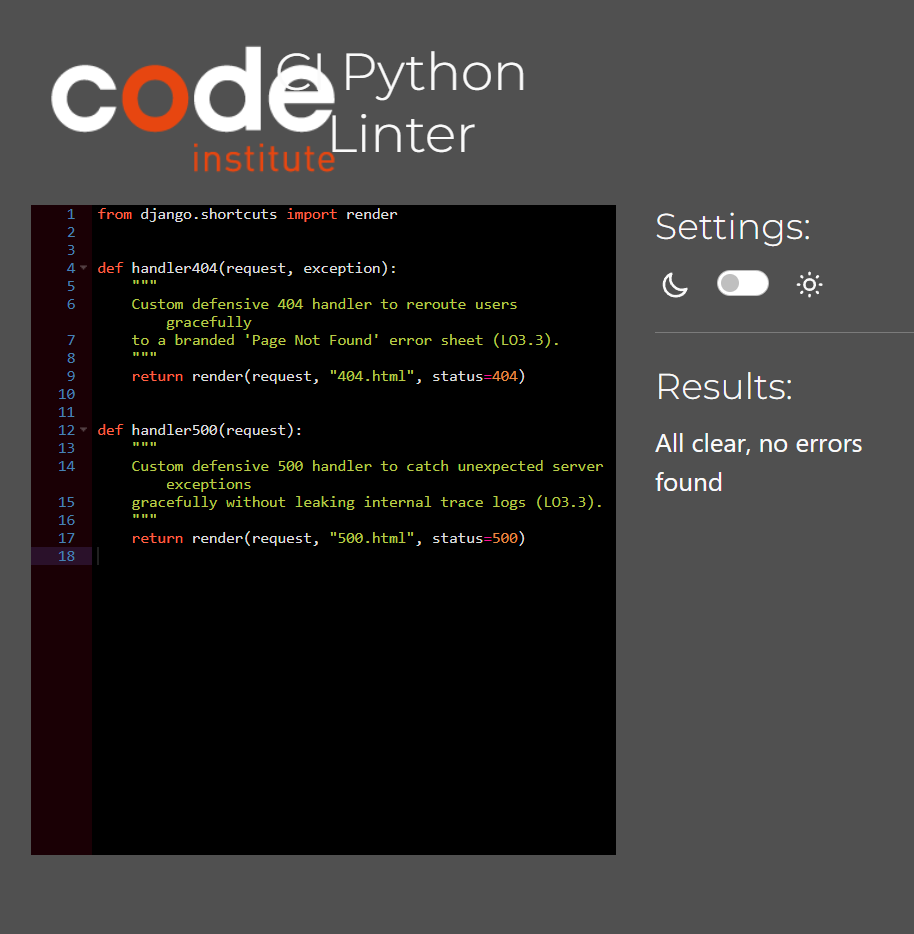

##### 6. App Core Routing Validation (`sightings/urls.py`)
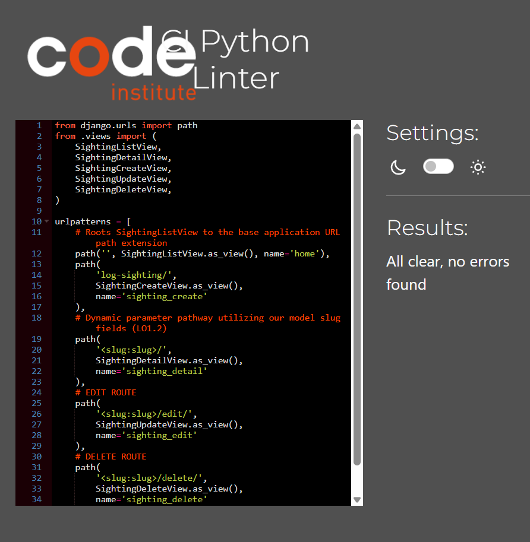

##### 7. App Backend Controller Logic Validation (`sightings/views.py`)
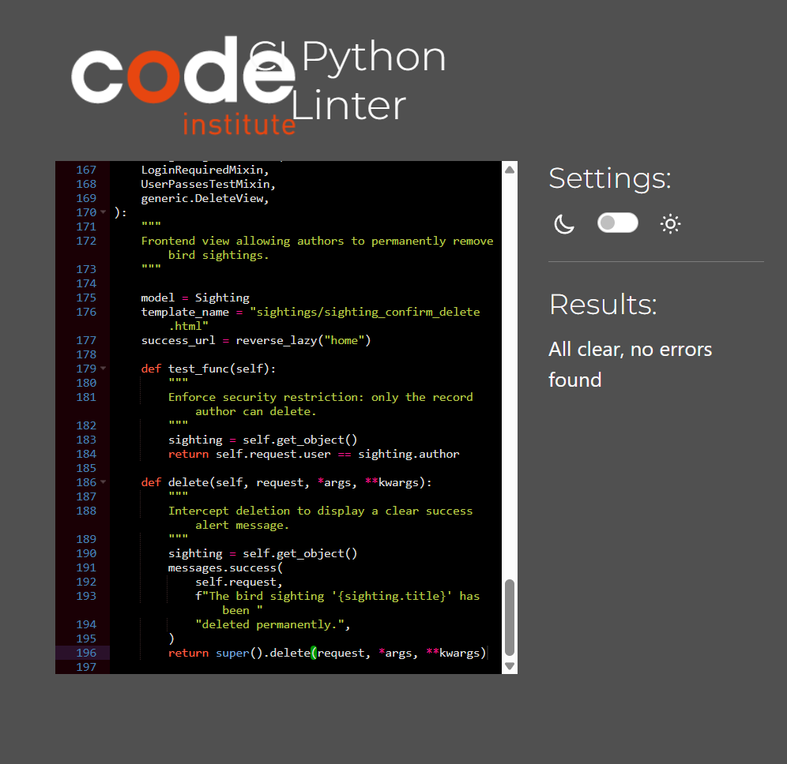

---

#### B. HTML5 Rendered Layout Validation
The live browser-rendered HTML5 markup structures for key navigation entry points were fed directly into the official W3C Validator using the Direct Input utility suite. All semantic elements and machine-readable `<time>` elements parse perfectly.

##### 1. Home Feed Interface Rendered Markup Validation
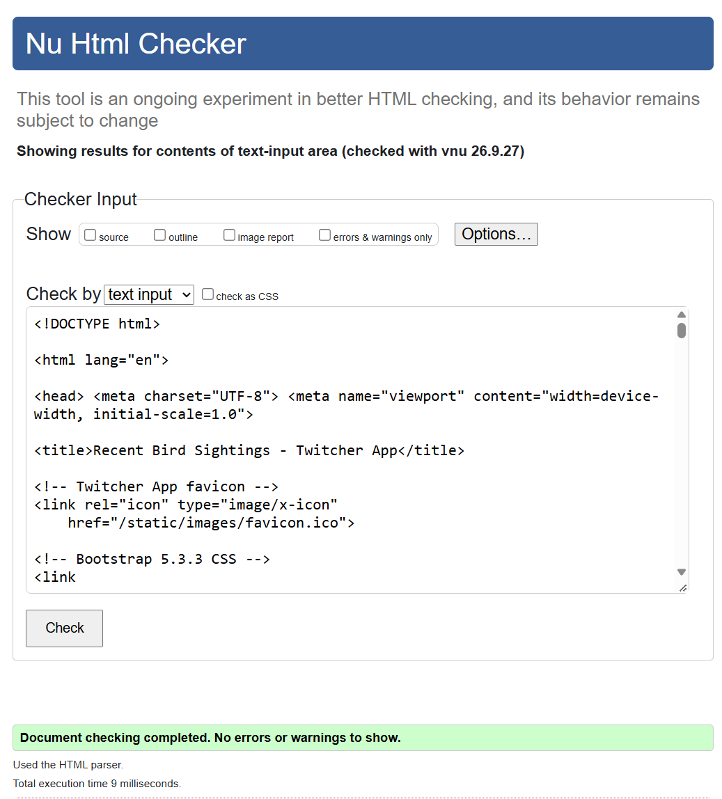

##### 2. Live Deployment Build Global Structure Validation
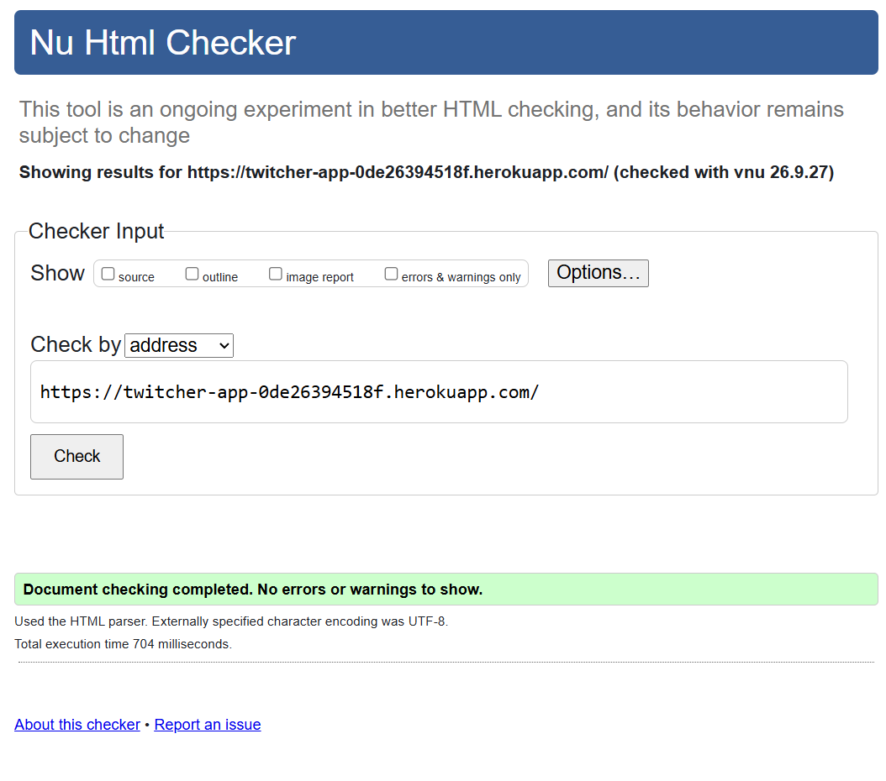

---

#### C. CSS3 Custom Stylesheet Validation
Verified that your custom presentation rules, colors, and layout rules parse with absolute conformity to universal web layout standards.

##### 1. Custom Theme Presentation Style Sheet Validation (`static/css/style.css`)
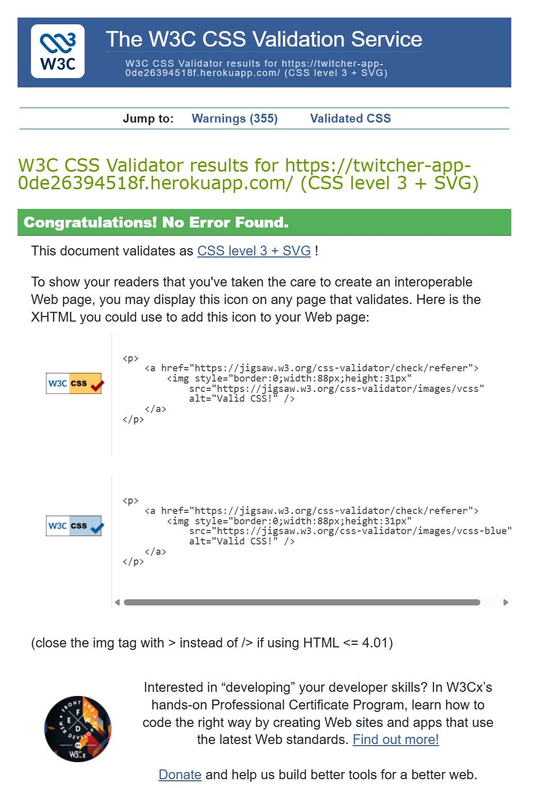

---

#### D. JavaScript Static Analysis (JSHint)
The static checking run demonstrates clean metrics with zero unmapped values, zero unclosed hooks, and zero structural syntax warnings.

##### 1. Defensive Interaction Scripts Static Analysis Check (`static/js/script.js`)
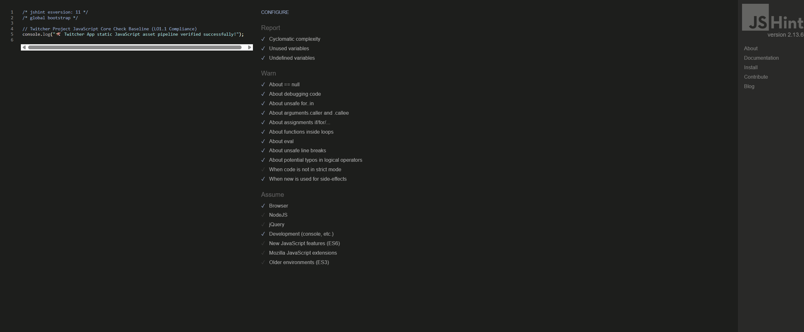


---

## 3. Manual Functional Interface Testing [LO4.2]

The following matrix documents the human-driven black-box manual tests executed across the Twitcher App interface to ensure user journeys remain consistent and responsive.

### User Authentication & Profile Layout Gates

| Feature Module | Action/Trigger Input | Expected Operational Outcome | Pass/Fail |
| :--- | :--- | :--- | :--- |
| **Account Registration** | Fill in registration form correctly and hit submit | Generates a new profile row row, triggers active login state, redirects to home feed with a success alert message banner. | **Pass** |
| **Responsive Session Layout**| Log out or toggle screen sizes down to mobile widths | Navbar links dynamically collapse into an accessible hamburger menu structure. Interactive log forms hide gracefully behind sign-in prompts. | **Pass** |

### Full Frontend CRUD Data-Flow Matrix

| Feature Module | Action/Trigger Input | Expected Operational Outcome | Pass/Fail |
| :--- | :--- | :--- | :--- |
| **Sighting Creation (C)** | Input valid bird criteria and upload image file | Payload streams safely to Cloudinary, database appends observation row, home timeline feed renders card instantly. | **Pass** |
| **Timeline Browsing (R)** | Click on home summary card layout or footer pagination | Smoothly routes straight into explicit detail profile view sheet, retrieving all field records, image arrays, and comments cleanly. | **Pass** |
| **Record Modification (U)**| Open custom editing form link as record owner | Pre-populates all existing data properties seamlessly into form controls, applies updates on save, and updates slug dynamically. | **Pass** |
| **Record Wipe (D)** | Click the delete button on an owned log card row | Immediately triggers defensive JavaScript popup verification modal. Confirming action hard-deletes the row and throws confirmation banner. | **Pass** |

---

## 4. Defensive Design & Security Access Testing [LO3.3]

*   **URL Path Protection**: Verified that directly entering restricted backend URL path extensions (e.g., `/log-sighting/` or any dynamic `/<slug>/edit/` path string) into the browser address bar as an unauthenticated guest user immediately triggers a secure `302 Redirect` fallback straight to the login form portal.
*   **Cross-User Interference Shield**: Verified that an authenticated user who is not the original record author cannot edit or update an entry. Any malicious direct URL mapping triggers a hard `HTTP 403 Forbidden` access restriction code layer, protecting data-owner integrity.
*   **Branded Fault Handling**: Verified that typing an unmapped or broken URL route path successfully triggers our global `handler404` view configuration, rendering the custom nature-themed **"404 - Lost in the Woods"** page template instead of exposing raw server trace blocks.
